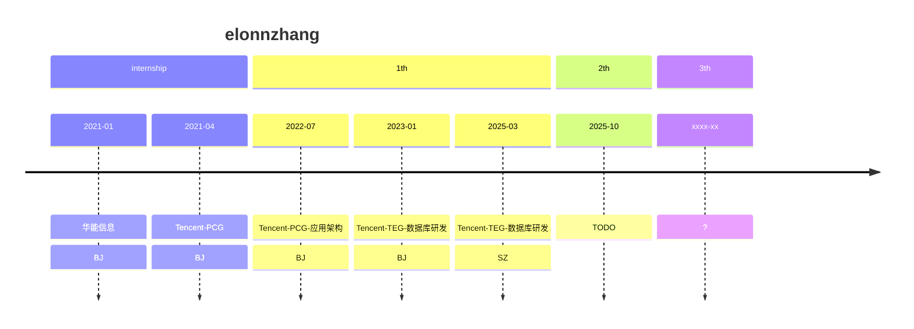

即将要要进行下一阶段了

 - [x] Tencent Done

[mermaid](https://www.mermaidchart.com/play)

细数一下领导

1. 第一任 leader 总监兼组长 aL
2. 第二任 leader 21.08 组织架构变更调整 & 第一任活水/转岗去TEG了 mL 晋升组长
3. 第三任 leader 23.01 组织架构调整 总监兼任组长 kL
	1. 期间 最开始架构调整到了隔壁组（组长是 hL），一段时间后，部门内调整到了现在组
4. 第四任 leader 24.04 从IEG来的组长 lL
	1. 隔壁组组长hL被下掉，lL 兼任隔壁组组长
5. 第五任 leader 25.07 wL，lL 不再管两个组，提拔 wL 为组长，