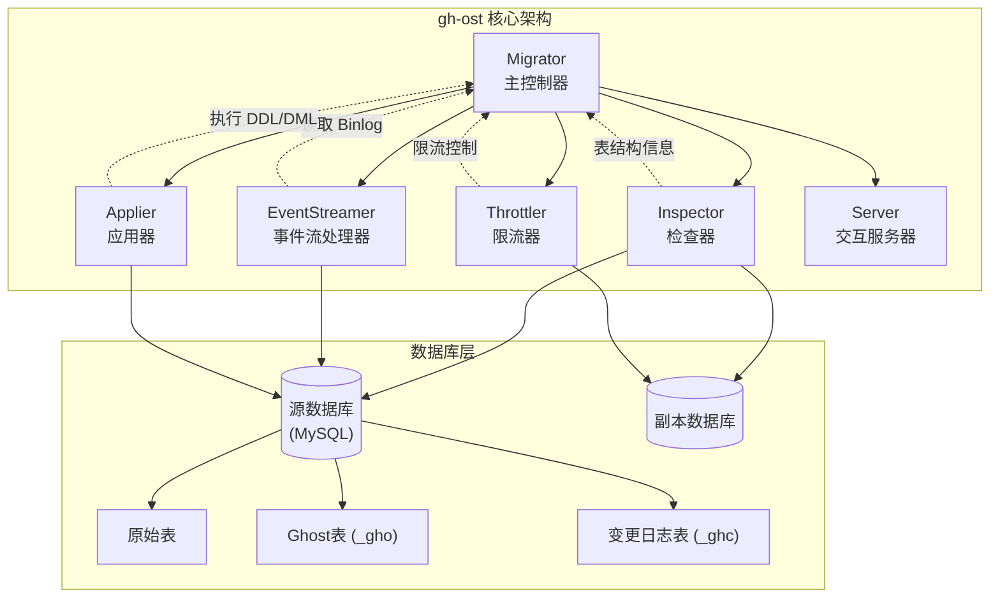

地址：
 - https://github.com/github/gh-ost/tree/master/go
 - https://deepwiki.com/github/gh-ost

目录结构

```
├── base
│   ├── context_test.go
│   ├── context.go
│   ├── default_logger.go
│   ├── load_map_test.go
│   ├── load_map.go
│   ├── utils_test.go
│   └── utils.go
├── binlog
│   ├── binlog_dml_event.go
│   ├── binlog_entry.go
│   ├── binlog_reader.go
│   ├── gomysql_reader.go
│   └── testdata
│       ├── mysql-bin.000066
│       ├── mysql-bin.000070
│       ├── rbr-sample-0.txt
│       ├── rbr-sample-1.txt
│       └── rbr-sample-2.txt
├── cmd
│   └── gh-ost
│       └── main.go
├── logic
│   ├── applier_test.go
│   ├── applier.go
│   ├── hooks_test.go
│   ├── hooks.go
│   ├── inspect_test.go
│   ├── inspect.go
│   ├── migrator_test.go
│   ├── migrator.go
│   ├── server_test.go
│   ├── server.go
│   ├── streamer_test.go
│   ├── streamer.go
│   ├── test_utils.go
│   └── throttler.go
├── mysql
│   ├── binlog_test.go
│   ├── binlog.go
│   ├── connection_test.go
│   ├── connection.go
│   ├── instance_key_map.go
│   ├── instance_key_test.go
│   ├── instance_key.go
│   ├── replica_terminology_map.go
│   └── utils.go
└── sql
    ├── builder_test.go
    ├── builder.go
    ├── encoding.go
    ├── parser_test.go
    ├── parser.go
    ├── types_test.go
    └── types.go

9 directories, 47 files
```


入口 `cmd/gh-ost/main.go`

```

func main(){
	migrationContext := base.NewMigrationContext()
	//...
	log.Infof("starting gh-ost %+v (git commit: %s)", AppVersion, GitCommit)
	acceptSignals(migrationContext)

	migrator := logic.NewMigrator(migrationContext, AppVersion)
	if err := migrator.Migrate(); err != nil {
		migrator.ExecOnFailureHook()
		migrationContext.Log.Fatale(err)
	}
	fmt.Fprintln(os.Stdout, "# Done")
}
```

1. 新建上下文
2. 设置参数
3. 接受信号、信号处理
4. 新建 Migrator
5. 执行

## 核心逻辑 

// Migrate executes the complete migration logic. This is *the* major gh-ost function.
func (this *Migrator) Migrate() (err error)

1. go this.listenOnPanicAbort() // 监听 panic
2. 「HOOK」this.hooksExecutor.onStartup()
3. 「Parser」「SQL」this.parser.ParseAlterStatement
4. 「SQL」this.validateAlterStatement()
5. defer this.teardown() // After this point, we'll need to teardown anything that's been started so we don't leave things hanging around
6. 「INIT」初始化组件
	1. 「Inspector」initiateInspector
	2. 「Streamer」initiateStreaming
	3. 「Applier」initiateApplier
	4. createFlagFiles
7. 尝试 instant online ddl ，可以执行的的话就直接执行返回了
8. 「Inspector」this.inspector.getReplicationLag()
9. 「Inspector」this.inspector.inspectOriginalAndGhostTables()  检查原始表和幽灵表以查看迁移是否有意义和有效
10. 「Applier」this.applier.prepareQueries()
11. 「HOOK」this.hooksExecutor.onValidated()
12. 「INIT」「Server」this.initiateServer()
13. 「Server」defer this.server.RemoveSocketFile()
14. this.countTableRows()    获取表行数 
15. this.addDMLEventsListener()  增加 DML 事件监听 
16. this.applier.ReadMigrationRangeValues()  拷贝范围（最大值最小值）
17. 「INIT」「Throttler」 this.initiateThrottler()
18. 「HOOK」this.hooksExecutor.onBeforeRowCopy()
19. go this.executeWriteFuncs()  通过`applier`写入`rowcopy`和`backlog`数据。 这是`ghost`表获取数据的地方。该函数以单线程方式填充数据。事件积压和行复制事件都被轮询；积压事件优先。
20. go this.iterateChunks() 迭代已经存在的数据，生成拷贝任务
21. this.migrationContext.MarkRowCopyStartTime()
22. go this.initiateStatus()
23. this.consumeRowCopyComplete() // -> this.migrationContext.MarkRowCopyEndTime()
24. 「HOOK」this.hooksExecutor.onRowCopyComplete()
25. 「HOOK」this.hooksExecutor.onBeforeCutOver()
26. this.finalCleanup()
27. 「HOOK」this.hooksExecutor.onSuccess()


```go
// executeWriteFuncs writes data via applier: both the rowcopy and the events backlog.
// This is where the ghost table gets the data. The function fills the data single-threaded.
// Both event backlog and rowcopy events are polled; the backlog events have precedence.
func (this *Migrator) executeWriteFuncs() error {
	if this.migrationContext.Noop {
		this.migrationContext.Log.Debugf("Noop operation; not really executing write funcs")
		return nil
	}
	for {
		if atomic.LoadInt64(&this.finishedMigrating) > 0 {
			return nil
		}

		this.throttler.throttle(nil)

		// We give higher priority to event processing, then secondary priority to
		// rowcopy
		select {
		case eventStruct := <-this.applyEventsQueue:
			{
				if err := this.onApplyEventStruct(eventStruct); err != nil {
					return err
				}
			}
		default:
			{
				select {
				case copyRowsFunc := <-this.copyRowsQueue:
					{
						copyRowsStartTime := time.Now()
						// Retries are handled within the copyRowsFunc
						if err := copyRowsFunc(); err != nil {
							return this.migrationContext.Log.Errore(err)
						}
						if niceRatio := this.migrationContext.GetNiceRatio(); niceRatio > 0 {
							copyRowsDuration := time.Since(copyRowsStartTime)
							sleepTimeNanosecondFloat64 := niceRatio * float64(copyRowsDuration.Nanoseconds())
							sleepTime := time.Duration(int64(sleepTimeNanosecondFloat64)) * time.Nanosecond
							time.Sleep(sleepTime)
						}
					}
				default:
					{
						// Hmmmmm... nothing in the queue; no events, but also no row copy.
						// This is possible upon load. Let's just sleep it over.
						this.migrationContext.Log.Debugf("Getting nothing in the write queue. Sleeping...")
						time.Sleep(time.Second)
					}
				}
			}
		}
	}
}
```

## 模块

Migrator
Inspector
Applier
EventStreamer
Throttler
gh-ost 中五个核心模块的架构关系图。基于代码分析，这些模块分别是：`Migrator`（主控制器）、`Inspector`（检查器）、`Applier`（应用器）、`EventStreamer`（事件流处理器）和 `Throttler`（限流器）。

### 模块架构关系图




### 模块职责说明

**Migrator（主控制器）** [1](#0-0) 
- 作为整个迁移过程的核心协调器
- 管理所有其他组件的生命周期
- 控制迁移的各个阶段：初始化、数据复制、切换等

**Inspector（检查器）** [2](#0-1) 
- 连接到 MySQL 服务器（通常是副本）收集信息
- 验证表结构、连接权限和复制状态
- 监控复制延迟

**Applier（应用器）**
- 管理实际的数据修改操作
- 创建 Ghost 表并应用 schema 变更
- 处理行复制和 binlog 事件的应用

**EventStreamer（事件流处理器）**
- 读取 MySQL 二进制日志捕获对原始表的持续变更
- 将 binlog 事件转换为可应用的操作

**Throttler（限流器）**
- 基于服务器负载、复制延迟等指标控制迁移速度
- 确保迁移过程不会对生产系统造成过大影响

### 工作流程

1. **初始化阶段**：Migrator 依次初始化各个组件 [3](#0-2) 
2. **验证阶段**：Inspector 验证表结构和权限
3. **复制阶段**：EventStreamer 开始监听 binlog，Applier 分块复制数据
4. **同步阶段**：持续应用 binlog 事件保持数据同步
5. **切换阶段**：原子性地交换原始表和 Ghost 表

**Notes**

这个架构图展示了 gh-ost 的核心设计理念：通过模块化的组件协作实现无触发器的在线 schema 迁移。每个组件都有明确的职责分工，Migrator 作为中央协调器确保整个流程的有序进行。

Wiki pages you might want to explore:
- [Overview (github/gh-ost)](/wiki/github/gh-ost#1)

## Inspector

### Inspector 模块概述

Inspector 是 gh-ost 中负责数据库检查和验证的核心组件，它连接到 MySQL 服务器（通常是副本）来收集模式信息、验证配置并检查复制状态。 [1](#0-0) 

### 主要职责

Inspector 模块的核心职责包括：

 1. 数据库连接和验证
- 建立数据库连接并验证连接有效性 [2](#0-1) 
- 验证用户权限是否足够执行迁移操作 [3](#0-2) 

 2. 表结构检查
- 验证原始表的存在性和有效性 [4](#0-3) 
- 检查表的列信息和唯一键 [5](#0-4) 
- 验证外键约束 [6](#0-5) 
- 检查触发器 [7](#0-6) 

 3. 二进制日志配置验证
- 验证二进制日志是否启用 [8](#0-7) 
- 应用正确的二进制日志格式（ROW 格式） [9](#0-8) 

 4. 表行数估算
- 通过 EXPLAIN 语句估算表的行数 [10](#0-9) 
- 提供精确的行数统计功能 [11](#0-10) 

 在迁移流程中的作用

Inspector 在 Migrator 的初始化阶段被调用，负责预检查工作： [12](#0-11) 

它还参与原始表和幽灵表的对比分析，确保迁移的兼容性： [13](#0-12) 

### 核心方法

- `InitDBConnections()`: 初始化数据库连接
- `ValidateOriginalTable()`: 验证原始表
- `InspectOriginalTable()`: 检查原始表结构
- `inspectOriginalAndGhostTables()`: 对比原始表和幽灵表

### Notes

Inspector 模块是 gh-ost 迁移流程的第一道关卡，确保所有前置条件都满足后才开始实际的迁移操作。它通过连接到副本服务器来避免对主库造成额外负载，同时收集必要的元数据信息供后续迁移步骤使用。

Wiki pages you might want to explore:
- [Core Components (github/gh-ost)](/wiki/github/gh-ost#2.1)

```go
func (this *Migrator) initiateInspector() (err error) {
	this.inspector = NewInspector(this.migrationContext)
	// 初始化连接
	if err := this.inspector.InitDBConnections(); err != nil {
		return err
	}
	// 检察源表
	if err := this.inspector.ValidateOriginalTable(); err != nil {
		return err
	}
	// 检查源表列和唯一键、自增值
	if err := this.inspector.InspectOriginalTable(); err != nil {
		return err
	}
	/// ...
	// 检查 slave
	if err := this.inspector.validateLogSlaveUpdates(); err != nil {
		return err
	}
```


```go
// Inspector reads data from the read-MySQL-server (typically a replica, but can be the master)
// It is used for gaining initial status and structure, and later also follow up on progress and changelog
type Inspector struct {
	connectionConfig    *mysql.ConnectionConfig
	db                  *gosql.DB
	dbVersion           string
	informationSchemaDb *gosql.DB
	migrationContext    *base.MigrationContext
	name                string
}

func NewInspector(migrationContext *base.MigrationContext) *Inspector {
	return &Inspector{
		connectionConfig: migrationContext.InspectorConnectionConfig,
		migrationContext: migrationContext,
		name:             "inspector",
	}
}
```


### 检查连接
```go
func (this *Inspector) InitDBConnections() (err error) {
	// DSN -> DB Connection
	// ...
// select @@global.version;select @@global.extra_port;select @@global.port (云 RDS)
	if err := this.validateConnection(); err != nil {
		return err
	}
	this.dbVersion = this.migrationContext.InspectorMySQLVersion

	if !this.migrationContext.AliyunRDS && !this.migrationContext.GoogleCloudPlatform && !this.migrationContext.AzureMySQL {
		if impliedKey, err := mysql.GetInstanceKey(this.db); err != nil {
			return err
		} else {
			this.connectionConfig.ImpliedKey = impliedKey
		}
	}
	if err := this.validateGrants(); err != nil {
		return err
	}
	if err := this.validateBinlogs(); err != nil {
		return err
	}
	if err := this.applyBinlogFormat(); err != nil {
		return err
	}
	this.migrationContext.Log.Infof("Inspector initiated on %+v, version %+v", this.connectionConfig.ImpliedKey, this.migrationContext.InspectorMySQLVersion)
	return nil
}
```


1. 检查链接有效性
version: select @@global.version;
extraPort:select @@global.extra_port;
```go
	// AliyunRDS set users port to "NULL", replace it by gh-ost param
	// GCP set users port to "NULL", replace it by gh-ost param
	// Azure MySQL set users port to a different value by design, replace it by gh-ost para
	var port int
	if migrationContext.AliyunRDS || migrationContext.GoogleCloudPlatform || migrationContext.AzureMySQL {
		port = connectionConfig.Key.Port
	} else {
		portQuery := `select @@global.port`
		if err := db.QueryRow(portQuery).Scan(&port); err != nil {
			return "", err
		}
	}
```
2. 检查权限
`show /* gh-ost */ grants for current_user()`
3. 检查 binlog
`select /* gh-ost */ @@global.log_bin, @@global.binlog_format`

### 检查源表
```go
func (this *Inspector) ValidateOriginalTable() (err error) {
	if err := this.validateTable(); err != nil {
		return err
	}
	if err := this.validateTableForeignKeys(this.migrationContext.DiscardForeignKeys); err != nil {
		return err
	}
	if err := this.validateTableTriggers(); err != nil {
		return err
	}
	if err := this.estimateTableRowsViaExplain(); err != nil {
		return err
	}
	return nil
}
```
validateTable `show /* gh-ost */ table status from %s like '%s'`


estimateTableRow `explain select /* gh-ost */ * from %s.%s where 1=1`

### 检查源表列和唯一键、自增值


## EventsStreamer 概述

`EventsStreamer` 是 gh-ost 架构中负责读取 MySQL 二进制日志（binlog）并流式传输事件的核心组件 <cite/>。它连接到 MySQL 作为副本来读取二进制日志，监听对被迁移表的数据操作，并将这些事件通知给感兴趣的监听器 <cite/>。

### 主要职责

- **连接 MySQL binlog**：作为副本连接到 MySQL 服务器读取二进制日志 <cite/>
- **事件流式传输**：持续流式传输 binlog 事件 <cite/>
- **监听器通知**：将 DML 操作（INSERT、UPDATE、DELETE）事件通知给注册的监听器 <cite/>
- **故障重连**：处理连接失败时的重连逻辑 <cite/>

### 核心方法

#### 初始化和配置
- `InitDBConnections()`：建立数据库连接 [1](#0-0) 
- `initBinlogReader()`：设置二进制日志读取器 <cite/>
- `readCurrentBinlogCoordinates()`：读取当前 binlog 位置 <cite/>

#### 事件处理
- `AddListener()`：注册对特定表事件感兴趣的组件 [2](#0-1) 
- `StreamEvents()`：开始流式传输 binlog 事件 [3](#0-2) 
- `notifyListeners()`：将事件传递给注册的监听器 <cite/>

### 在迁移过程中的作用

在 `Migrator` 中，`EventsStreamer` 通过 `initiateStreaming()` 方法被初始化 [4](#0-3) 。该方法：

1. 创建新的 `EventsStreamer` 实例 [5](#0-4) 
2. 初始化数据库连接 [6](#0-5) 
3. 添加对 changelog 表的监听器 [7](#0-6) 
4. 启动异步的事件流式传输 [8](#0-7) 
5. 定期更新 binlog 坐标 [9](#0-8) 

### 清理过程

在迁移结束时，`EventsStreamer` 会被正确清理。在 `finalCleanup()` 中调用 `eventsStreamer.Close()` [10](#0-9) ，在 `teardown()` 中调用 `eventsStreamer.Teardown()` [11](#0-10) 。

### Notes

`EventsStreamer` 是 gh-ost 实现在线迁移的关键组件，它确保在数据复制过程中不会丢失对原表的任何更改。通过监听 binlog 事件，它能够将对原表的实时更改应用到 ghost 表上，保证数据一致性。

Wiki pages you might want to explore:
- [Core Components (github/gh-ost)](/wiki/github/gh-ost#2.1)

```go
// initiateStreaming begins streaming of binary log events and registers listeners for such events
func (this *Migrator) initiateStreaming() error {
	this.eventsStreamer = NewEventsStreamer(this.migrationContext)
	if err := this.eventsStreamer.InitDBConnections(); err != nil {
		return err
	}
	this.eventsStreamer.AddListener(
		false,
		this.migrationContext.DatabaseName,
		this.migrationContext.GetChangelogTableName(),
		func(dmlEvent *binlog.BinlogDMLEvent) error {
			return this.onChangelogEvent(dmlEvent)
		},
	)

	go func() {
		this.migrationContext.Log.Debugf("Beginning streaming")
		err := this.eventsStreamer.StreamEvents(this.canStopStreaming)
		if err != nil {
			this.migrationContext.PanicAbort <- err
		}
		this.migrationContext.Log.Debugf("Done streaming")
	}()

	go func() {
		ticker := time.NewTicker(time.Second)
		defer ticker.Stop()
		for range ticker.C {
			if atomic.LoadInt64(&this.finishedMigrating) > 0 {
				return
			}
			this.migrationContext.SetRecentBinlogCoordinates(*this.eventsStreamer.GetCurrentBinlogCoordinates())
		}
	}()
	return nil
}
```
1. NewEventsStreamer
2. AddListener
3. go StreamEvents


## Applier 模块概述

Applier 是 gh-ost 迁移系统中负责执行数据库写操作的核心组件 [1](#0-0) 。它连接到目标数据库服务器，执行模式变更和行修改操作<cite/>。

### 主要职责

Applier 模块的核心职责包括：<cite/>

- **创建和修改 Ghost 表**：创建具有原始模式的 ghost 表，并应用 ALTER 语句<cite/>
- **创建 Changelog 表**：用于跟踪迁移状态和心跳<cite/>
- **构建和执行 DML 查询**：处理 INSERT、UPDATE、DELETE 操作<cite/>
- **执行最终表交换**：在迁移完成时进行原子性的表切换<cite/>
- **处理 Cut-over 操作**：管理迁移的关键切换阶段<cite/>
- **写入 Changelog 条目**：记录迁移进度和状态<cite/>

### 在迁移流程中的作用

在 Migrator 的初始化过程中，Applier 通过 `initiateApplier()` 方法被创建和配置 [2](#0-1) 。该方法执行以下关键步骤：

1. 初始化数据库连接 [3](#0-2) 
2. 验证或删除现有表 [4](#0-3) 
3. 创建 changelog 表 [5](#0-4) 
4. 创建 ghost 表 [6](#0-5) 
5. 对 ghost 表应用 ALTER 语句 [7](#0-6) 

### 与其他组件的交互

Applier 与其他核心组件紧密协作：<cite/>

- **与 Migrator 的关系**：作为 Migrator 结构体的成员，接受 Migrator 的协调和控制 [1](#0-0) 
- **与 EventsStreamer 的协作**：接收来自 binlog 流的 DML 事件并应用到 ghost 表<cite/>
- **与 Throttler 的配合**：在执行写操作时受到节流控制，确保不会对生产系统造成过大影响<cite/>

### 执行写操作

在迁移的数据复制阶段，Applier 通过 `executeWriteFuncs()` 方法处理写操作 [8](#0-7) 。该方法优先处理事件队列中的 DML 操作，然后处理行复制操作 [9](#0-8) 。

### Cut-over 操作

Applier 在迁移的最终阶段执行关键的 cut-over 操作，包括原子性表重命名 [10](#0-9) 和两步式表交换 [11](#0-10) ，确保迁移过程中的数据一致性。<cite/>

### Notes

Applier 模块是 gh-ost 实现在线模式迁移的核心执行组件，它通过精心设计的操作序列和与其他组件的协调，确保了迁移过程的安全性和数据完整性。该模块的设计体现了 gh-ost 对生产环境友好的核心理念。<cite/>

Wiki pages you might want to explore:
- [Core Components (github/gh-ost)](/wiki/github/gh-ost#2.1)


```go
func (this *Migrator) initiateApplier() error {
	this.applier = NewApplier(this.migrationContext)
	if err := this.applier.InitDBConnections(); err != nil {
		return err
	}
	if err := this.applier.ValidateOrDropExistingTables(); err != nil {
		return err
	}
	if err := this.applier.CreateChangelogTable(); err != nil {
		this.migrationContext.Log.Errorf("Unable to create changelog table, see further error details. Perhaps a previous migration failed without dropping the table? OR is there a running migration? Bailing out")
		return err
	}
	if err := this.applier.CreateGhostTable(); err != nil {
		this.migrationContext.Log.Errorf("Unable to create ghost table, see further error details. Perhaps a previous migration failed without dropping the table? Bailing out")
		return err
	}

	if err := this.applier.AlterGhost(); err != nil {
		this.migrationContext.Log.Errorf("Unable to ALTER ghost table, see further error details. Bailing out")
		return err
	}

	if this.migrationContext.OriginalTableAutoIncrement > 0 && !this.parser.IsAutoIncrementDefined() {
		// Original table has AUTO_INCREMENT value and the -alter statement does not indicate any override,
		// so we should copy AUTO_INCREMENT value onto our ghost table.
		if err := this.applier.AlterGhostAutoIncrement(); err != nil {
			this.migrationContext.Log.Errorf("Unable to ALTER ghost table AUTO_INCREMENT value, see further error details. Bailing out")
			return err
		}
	}
	this.applier.WriteChangelogState(string(GhostTableMigrated))
	if err := this.applier.StateMetadataLockInstrument(); err != nil {
		this.migrationContext.Log.Errorf("Unable to enable metadata lock instrument, see further error details. Bailing out")
		return err
	}
	go this.applier.InitiateHeartbeat()
	return nil
}
```

1. NewApplier
2. InitDBConnections
3. ValidateOrDropExistingTables (表 gho )
4. CreateChangelogTable (表 ghc)
5. CreateGhostTable (表 gho)
6. AlterGhost
7. AlterGhostAutoIncrement
8. WriteChangelogState
9. this.applier.InitiateHeartbeat()


## Server

Server 模块是 gh-ost 中提供交互式命令接口的组件，允许操作员在迁移过程中控制和监控迁移状态 <cite/>。

### Server 模块的核心功能

Server 模块在 `Migrator` 中通过 `initiateServer()` 方法初始化 [1](#0-0) 。该模块支持两种连接方式：

1. **Unix Socket 连接** - 通过 `BindSocketFile()` 创建本地套接字文件
2. **TCP 端口连接** - 通过 `BindTCPPort()` 绑定 TCP 端口以支持远程访问

### 主要职责

Server 模块的主要职责包括：
- 提供迁移过程中的交互式控制
- 通过 Unix socket 或 TCP 端口接受命令
- 显示迁移状态信息
- 支持节流控制命令（throttle/unthrottle）
- 提供紧急终止功能（panic 命令）

### 在迁移流程中的位置

Server 在迁移的验证阶段完成后启动 [2](#0-1) ，并在迁移完成后通过 `defer this.server.RemoveSocketFile()` 清理套接字文件。

### 状态显示功能

Server 模块还负责显示详细的迁移状态信息，包括：
- 源表和目标表信息
- 连接配置详情
- 迁移参数（chunk-size、max-lag-millis 等）
- 节流配置和标志文件状态 [3](#0-2) 

### Notes

Server 模块是 gh-ost 架构中七个核心组件之一，与其他组件（Migrator、Inspector、Applier、EventsStreamer、Throttler、HooksExecutor）协同工作。它通过共享的 `MigrationContext` 获取迁移状态信息，为用户提供实时的迁移监控和控制能力。

Wiki pages you might want to explore:
- [Core Components (github/gh-ost)](/wiki/github/gh-ost#2.1)

```go
// initiateServer begins listening on unix socket/tcp for incoming interactive commands
func (this *Migrator) initiateServer() (err error) {
	var f printStatusFunc = func(rule PrintStatusRule, writer io.Writer) {
		this.printStatus(rule, writer)
	}
	this.server = NewServer(this.migrationContext, this.hooksExecutor, f)
	if err := this.server.BindSocketFile(); err != nil {
		return err
	}
	if err := this.server.BindTCPPort(); err != nil {
		return err
	}

	go this.server.Serve()
	return nil
}
```


## Throttler 

Throttler 是 gh-ost 中负责控制迁移速度的核心组件，用于确保数据库迁移过程不会对生产系统造成过大影响。 [1](#0-0)  它作为 Migrator 的一个重要组成部分，监控各种系统指标并在必要时暂停或减缓迁移操作。<cite/>

### 初始化和启动

Throttler 在迁移过程中通过 `initiateThrottler` 方法初始化： [2](#0-1) 

该方法创建 Throttler 实例并启动两个关键的 goroutine：
- `initiateThrottlerCollection`：收集节流指标
- `initiateThrottlerChecks`：执行节流检查

系统会等待三种类型的初始指标收集完成：复制延迟、HTTP 状态和其他通用指标。<cite/>

### 节流控制机制

Throttler 在数据写入过程中发挥关键作用。在 `executeWriteFuncs` 方法中，每次执行写操作前都会调用 `throttler.throttle(nil)`： [3](#0-2) 

这确保了在处理事件队列和行复制操作之前，系统会检查是否需要节流。<cite/>

### 切换阶段的节流

在关键的表切换（cut-over）阶段，Throttler 也起到重要作用。在 `cutOver` 方法中，系统会在交换表之前进行节流检查： [4](#0-3) 

这确保了在执行最关键的表交换操作之前，系统处于稳定状态。<cite/>

### 资源清理

当迁移完成或需要清理时，Throttler 会在 `teardown` 方法中被正确关闭： [5](#0-4) 

### Notes

Throttler 是 gh-ost 安全迁移机制的核心组件，通过监控复制延迟、系统负载、HTTP 端点状态等多种指标来动态控制迁移速度。它与 Migrator 的其他组件（Inspector、Applier、EventsStreamer）紧密协作，确保整个迁移过程的稳定性和安全性。具体的节流逻辑实现位于单独的 throttler.go 文件中，但从 migrator.go 中可以看到它在整个迁移流程中的关键作用点。

Wiki pages you might want to explore:
- [Overview (github/gh-ost)](/wiki/github/gh-ost#1)


## Hook 系统概述

gh-ost 的 hook 系统允许用户在迁移过程的关键节点执行自定义脚本，通过 `HooksExecutor` 组件实现。 [1](#0-0) 

### Hook 执行点

gh-ost 在以下关键时刻执行 hook：

1. **startup** - 迁移开始时执行 [2](#0-1) 
2. **validated** - 表和配置验证完成后执行 [3](#0-2) 
3. **before-row-copy** - 行复制阶段开始前执行 [4](#0-3) 
4. **row-copy-complete** - 所有行复制完成后执行 [5](#0-4) 
5. **before-cut-over** - 最终表切换前执行 [6](#0-5) 
6. **success** - 迁移成功完成时执行 [7](#0-6) 
7. **failure** - 迁移失败时执行 [7](#0-6) 

### Hook 的作用

Hook 系统使用户能够：
- 在迁移的关键节点执行自定义逻辑
- 集成外部监控和通知系统
- 实现自定义的验证和检查
- 处理迁移过程中的特殊需求

### 实现方式

`HooksExecutor` 在 `Migrator` 初始化时创建，并在整个迁移过程中被调用来执行相应的 hook 脚本。 [1](#0-0)  Hook 的执行与迁移的主要流程紧密集成，确保在正确的时机触发用户定义的操作。

### Notes

Hook 系统是 gh-ost 提供的扩展机制，让用户可以在不修改核心代码的情况下定制迁移行为。每个 hook 都对应迁移过程中的特定阶段，为用户提供了充分的控制和监控能力。

Wiki pages you might want to explore:
- [Core Components (github/gh-ost)](/wiki/github/gh-ost#2.1)


参考
https://blog.csdn.net/qq_33997198/article/details/120181651