> 基于 [google/adk-go](https://github.com/google/adk-go) 的 LLM Flow 源码阅读。DeepWiki 的 dump 翻译整理，代码对照本地 `adk-go`。
>
> 上一篇：[ADK. -Model](/adk-model)

一句话：`llminternal.Flow` 是 LLM agent 的执行循环。它把空的 `model.LLMRequest` 拼成完整请求，调用模型，执行工具，再产出 `session.Event`，直到拿到最终回答或发生 agent transfer。

```text
llmagent
  -> llminternal.Flow.Run
       -> runOneStep
            -> preprocess（RequestProcessors）
            -> callLLM
                 BeforeModel / Plugin.BeforeModel
                 model.LLM.GenerateContent
                 streamingResponseAggregator
                 AfterModel / OnModelError
            -> postprocess（ResponseProcessors）
            -> finalizeModelResponseEvent
            -> handleFunctionCalls
            -> transfer_to_agent?
```

## 代码位置

核心都在 `internal/llminternal`：

```text
internal/llminternal
├── base_flow.go                 Flow / Run / runOneStep / callLLM / handleFunctionCalls
├── contents_processor.go        session 历史 -> []*genai.Content
├── instruction_processor.go     system / agent instruction + {placeholder}
├── outputschema_processor.go    OutputSchema / set_model_response
├── stream_aggregator.go         流式 chunk 聚合成最终 LLMResponse
├── request_confirmation_processor.go  HITL 确认
└── agent_transfer.go            transfer_to_agent
```

对照源码：

- `internal/llminternal/base_flow.go:66` `Flow`
- `internal/llminternal/base_flow.go:122` `Run`
- `internal/llminternal/base_flow.go:612` `runOneStep`
- `internal/llminternal/base_flow.go:815` `callLLM`
- `internal/llminternal/base_flow.go:1160` `handleFunctionCalls`
- `internal/llminternal/contents_processor.go:39` `ContentsRequestProcessor`
- `internal/llminternal/stream_aggregator.go:33` `streamingResponseAggregator`
- `session/session.go:100` `Event`

[GitHub: base_flow.go](https://github.com/google/adk-go/blob/master/internal/llminternal/base_flow.go) · [contents_processor.go](https://github.com/google/adk-go/blob/master/internal/llminternal/contents_processor.go) · [stream_aggregator.go](https://github.com/google/adk-go/blob/master/internal/llminternal/stream_aggregator.go)

## Flow 结构

每次 LLM agent 调用都会 new 一个 `Flow`，带上这个 agent 的 model、tools、processors 和 callbacks。

```go
// internal/llminternal/base_flow.go:66
type Flow struct {
	Model model.LLM

	Tools                 []tool.Tool
	RequestProcessors     []func(ctx agent.InvocationContext, req *model.LLMRequest, f *Flow) iter.Seq2[*session.Event, error]
	ResponseProcessors    []func(ctx agent.InvocationContext, req *model.LLMRequest, resp *model.LLMResponse) error
	BeforeModelCallbacks  []BeforeModelCallback
	AfterModelCallbacks   []AfterModelCallback
	OnModelErrorCallbacks []OnModelErrorCallback
	BeforeToolCallbacks   []BeforeToolCallback
	AfterToolCallbacks    []AfterToolCallback
	OnToolErrorCallbacks  []OnToolErrorCallback
}
```

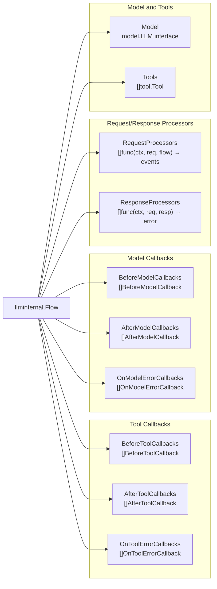

| 字段 | 作用 |
| --- | --- |
| `Model` | 真正 generate content 的后端，比如 Gemini |
| `Tools` | 这个 agent 能调的工具 |
| `RequestProcessors` | 请求拼装管线，默认 13 个 |
| `ResponseProcessors` | 响应后处理，默认 2 个 |
| `Before/After/OnModelError` | 包住 `GenerateContent` |
| `Before/After/OnToolError` | 包住 `Tool.Run` |

Processor 和 Callback 不是一类东西：processor 是框架默认管线，callback 是用户挂上来的拦截点。`llmagent.New` 把 `llmagent.Config` 里的 callback 拷进 `Flow`。

## 执行循环

两层循环：外层 `Run` 一直跑到终态，内层 `runOneStep` 走完一次「拼请求 → 调模型 → 跑工具」。

### 外层：`Flow.Run`

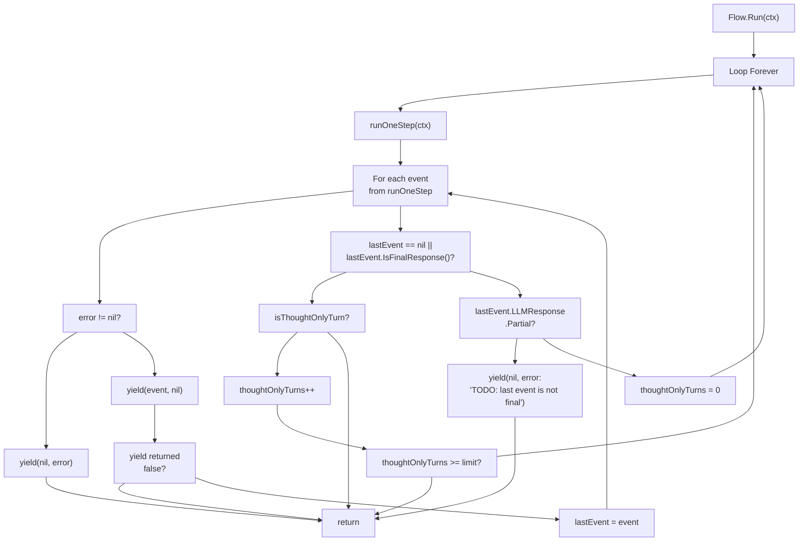

当前实现里，partial 收尾已经不再当成 error 往外抛，而是打 warning 后结束这一轮，避免把截断流再循环一次。thought-only 上限仍是写死的 `maxConsecutiveThoughtOnlyTurns = 10`：模型连续 10 次只 think 不给答案，就停。

终态判断看 `session.Event.IsFinalResponse()`：

- compaction 事件不是最终回答
- `SkipSummarization` 或 long-running tool 视为终态
- 没有 function call / function response、不是 partial，才是普通最终回答

thought-only turn 也报 final，但 `isThoughtOnlyTurn` 会把它拦下来，再打一轮模型。

### 内层：`runOneStep`

一次完整的 request-response：

1. `preprocess`：按顺序跑 `RequestProcessors`，再做 `toolPreprocess` / `toolsetPreprocess`
2. `callLLM`：回调 + `GenerateContent`
3. `postprocess`：跑 `ResponseProcessors`
4. `finalizeModelResponseEvent`：做成 `session.Event` yield 出去
5. 非 partial 才 `handleFunctionCalls`
6. 如有 HITL confirmation，再 yield 一个 confirmation event
7. 如有 `set_model_response`，再 yield 一条最终结构化回答
8. `Actions.TransferToAgent` 非空则切到下一个 agent 继续 `Run`

partial 事件只往外流，不执行工具。空 content 且没有 error / interrupt 的响应会被跳过，这是给 code executor 再绕一圈用的。

## 请求处理器

Request processor 把空的 `model.LLMRequest` 填成能发给模型的请求。签名：

```go
func(ctx agent.InvocationContext, req *model.LLMRequest, f *Flow) iter.Seq2[*session.Event, error]
```

它可以改 `req`，也可以中途 yield event，比如要用户确认或补凭证。Response processor 更简单，同步改 `model.LLMResponse`：

```go
func(ctx agent.InvocationContext, req *model.LLMRequest, resp *model.LLMResponse) error
```

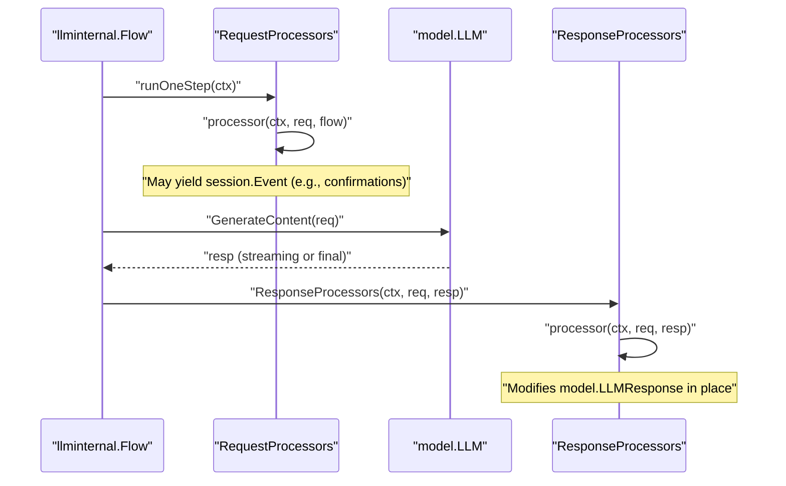

默认请求管线顺序是写死的，后面的 processor 依赖前面的结果：

```mermaid
flowchart TD
    Start["model.LLMRequest (empty)"]
    basicRequestProcessor["basicRequestProcessor: Sets basic request fields"]
    toolProcessor["toolProcessor: Adds tools to request"]
    authPreprocessor["authPreprocessor: Handles authentication"]
    RequestConfirmationRequestProcessor["RequestConfirmationRequestProcessor: Handles HITL confirmations"]
    instructionsRequestProcessor["instructionsRequestProcessor: Adds system instructions"]
    identityRequestProcessor["identityRequestProcessor: Sets agent identity"]
    CompactionRequestProcessor["CompactionRequestProcessor: History compaction"]
    ContentsRequestProcessor["ContentsRequestProcessor: Converts history to LLM contents"]
    nlPlanningRequestProcessor["nlPlanningRequestProcessor: Handles NL planning"]
    codeExecutionRequestProcessor["codeExecutionRequestProcessor: Optimizes code execution"]
    outputSchemaRequestProcessor["outputSchemaRequestProcessor: Sets output schema"]
    AgentTransferRequestProcessor["AgentTransferRequestProcessor: Adds transfer tools"]
    removeDisplayNameIfExists["removeDisplayNameIfExists: Cleans display names"]
    End["model.LLMRequest (ready for LLM)"]
    Start --> basicRequestProcessor
    basicRequestProcessor --> toolProcessor
    toolProcessor --> authPreprocessor
    authPreprocessor --> RequestConfirmationRequestProcessor
    RequestConfirmationRequestProcessor --> instructionsRequestProcessor
    instructionsRequestProcessor --> identityRequestProcessor
    identityRequestProcessor --> CompactionRequestProcessor
    CompactionRequestProcessor --> ContentsRequestProcessor
    ContentsRequestProcessor --> nlPlanningRequestProcessor
    nlPlanningRequestProcessor --> codeExecutionRequestProcessor
    codeExecutionRequestProcessor --> outputSchemaRequestProcessor
    outputSchemaRequestProcessor --> AgentTransferRequestProcessor
    AgentTransferRequestProcessor --> removeDisplayNameIfExists
    removeDisplayNameIfExists --> End
```

| 顺序 | Processor | 做什么 |
| --- | --- | --- |
| 1 | `basicRequestProcessor` | 模型名、generation config |
| 2 | `toolProcessor` | 把 tools 填进 `req.Tools`，声明写到 `req.Config.Tools` |
| 3 | `authPreprocessor` | 需要凭证的工具先发 credential 请求 |
| 4 | `RequestConfirmationRequestProcessor` | HITL 确认协议 |
| 5 | `instructionsRequestProcessor` | 根 agent 全局 instruction + 当前 agent instruction，并做 `{placeholder}` 注入 |
| 6 | `identityRequestProcessor` | agent 身份 |
| 7 | `CompactionRequestProcessor` | 先摘要历史。必须在 contents 之前，这轮请求才能看到 summary |
| 8 | `ContentsRequestProcessor` | session 历史转成 `req.Contents` |
| 9 | `nlPlanningRequestProcessor` | 依赖已经拼好的 contents |
| 10 | `codeExecutionRequestProcessor` | 改 contents，优化 code execution 的数据文件 |
| 11 | `outputSchemaRequestProcessor` | 结构化输出；模型和工具不能同时走 native schema 时，改挂 `set_model_response` |
| 12 | `AgentTransferRequestProcessor` | 需要时加上 `transfer_to_agent` |
| 13 | `removeDisplayNameIfExists` | 清掉 display name |

默认响应处理器只有两个：`nlPlanningResponseProcessor`、`codeExecutionResponseProcessor`。

几个值得单独看的 processor：

**`instructionsRequestProcessor`**

先挂 root agent 的 global instruction，再挂当前 agent 的 instruction。静态文本走 `InjectSessionState`，把 `{user_name}`、`{artifact.file_name}` 这类占位符换成 session state / artifact。也可以用 `InstructionProvider` 动态生成。

**`outputSchemaRequestProcessor`**

agent 配了 `OutputSchema` 才工作。模型不能一边 native schema 一边 tool calling 时，就注入 `set_model_response` 工具，让模型用 function call 交结构化结果。`runOneStep` 后面会把这个 tool response 再做成一条最终 model event。

**`ContentsRequestProcessor`**

下一节单独讲。它是整条请求管线里最重的一步。

## 内容拼装

`ContentsRequestProcessor` 把 session 事件历史变成发给模型的 `[]*genai.Content`。

两种策略：

- `IncludeContents` 为空或 `"default"`：`buildContentsDefault`，带过滤和重排的完整历史
- `"none"`，或 single-turn placement 且没有显式要求保留历史：`buildContentsCurrentTurnContextOnly`，只留本轮用户输入 / agent transfer，以及本轮 tool call/response

current-turn 的起点是最近一条 author 为 `"user"` 或「别的 agent」的事件。compaction record 只有这次 run 真的开了 compaction 才会进历史，避免工具或 REST create-session 随便写一条 compaction 就把对话抹掉。

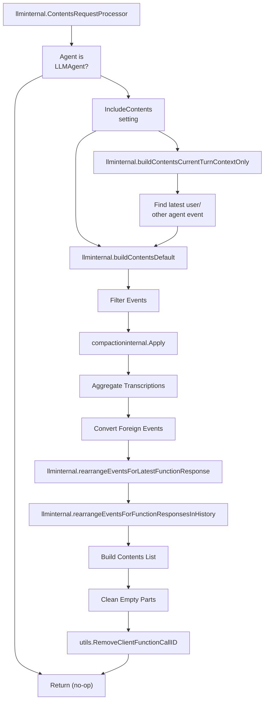

### 事件过滤

| 过滤 | 条件 | 目的 |
| --- | --- | --- |
| 空内容 | 没 content / 没 role / 没 parts，且没有 transcription / 可用 summary | 丢掉无意义事件 |
| Branch | `!eventBelongsToBranch(...)` | 多 agent 时不看兄弟分支 |
| IsolationScope | 必须精确相等；空只看见空 | scoped agent 只看自己的任务上下文 |
| Auth / confirmation | function 名是 `adk_request_credential` 或 confirmation | 凭证和 HITL 交互不进模型历史 |
| 其他 agent | `isOtherAgentReply` | 不丢，转成 user context |

Branch 规则在 `internal/utils/utils.go:196`：

- invocation 或 event 的 branch 为空：一律可见
- 完全相等：可见
- invocation 以 `event.Branch + "."` 为前缀：可见。`"agent_1.agent_2"` 能看到 `"agent_1"`，但 `"agent_0"` 看不到 `"agent_00"`

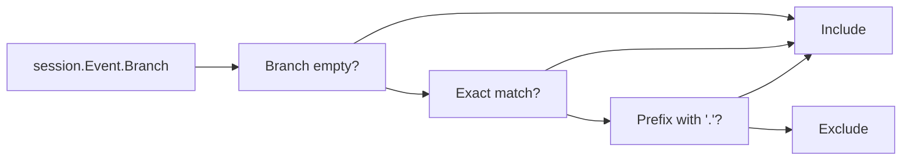

IsolationScope 更严：不是前缀，是精确匹配。task / single-turn agent 的 originating function call 往往在未 scoped 的父事件上，过滤后会丢，所以后面会用 `buildTaskInputUserContent` 从 FC args 再拼一条合成 user content，当成这个 agent 的第一轮输入。

### 转录、其他 agent、call/response 重排

Live 会话里，没有 content 但有 `InputTranscription` / `OutputTranscription` 的事件会合成文本：input → `user`，output → `model`。连续多条会先拼再落成一个 part。

其他 agent 的输出不能原样当 `model` role，否则会打乱当前模型和自己历史的对应关系。`ConvertForeignEvent` 把它们改成 `user`，并加上 `"For context:"`：

| 原 part | 转成 |
| --- | --- |
| Text | `[{author}] said: {text}` |
| FunctionCall | `[{author}] called tool '{name}' with parameters: {json}` |
| FunctionResponse | `[{author}] '{name}' tool returned result: {json}` |
| 其他 | 原样保留，比如图片 |

异步 / 长跑工具会让 function call 和 response 中间夹杂别的事件。模型上下文要求 call/response 相邻，所以：

1. `rearrangeEventsForLatestFunctionResponse` 先把最近一次 response 贴回对应 call
2. `rearrangeEventsForFunctionResponsesInHistory` 再扫整段历史，修所有旧的 call/response 对
3. `dropOrphanedFunctionResponses` 丢掉找不到 call 的孤儿 response

最后再做一次规范化：去掉空 part、用 `utils.RemoveClientFunctionCallID` 删掉 `adk-` 前缀的内部 call ID。如果历史最后一条还是 model，就补一条合成 user：

> Continue processing previous requests as instructed. Exit or provide a summary if no more outputs are needed.

Gemini 要求 user / model 严格交替，这条 nudge 就是为了这个。

## 调模型

`callLLM` 包住真正的 `model.LLM.GenerateContent`，顺序和 [ADK. -Model](/adk-model) 里写的一致：

```text
callLLM
  1. Plugin.BeforeModel     非 nil 就短路，不打模型
  2. BeforeModelCallbacks   同样短路
  3. useStream = (RunConfig.StreamingMode == "sse")
  4. generateContent(...)   只把 LLM 调用放进 span
  5. 出错 → OnModelErrorCallbacks，可以把 error 变成假响应
  6. PopulateClientFunctionCallID
  7. AfterModelCallbacks    可以替换响应
```

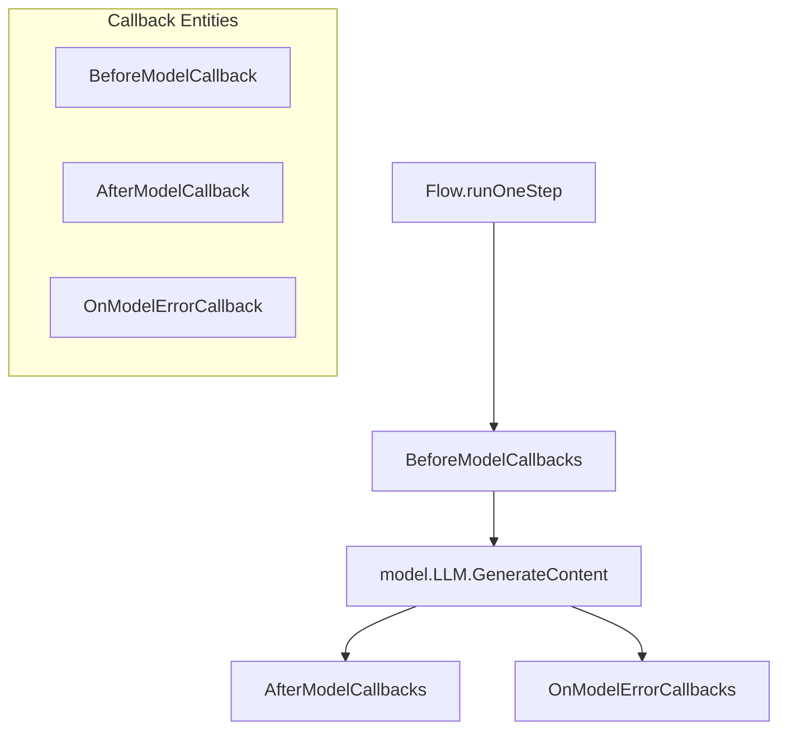

Streaming 与否看 invocation 自己的 `RunConfig`，不看 Go context 里那份。原因是 `agent.Run()` 可以不经过 runner 直接调，那时候 context 里没有 runconfig。

## Callbacks

六个拦截点，`llmagent.Config` 配好，`llmagent.New` 填进 `Flow`。

| Callback | 触发点 | 能否跳过真正执行 |
| --- | --- | --- |
| `BeforeModelCallback` | `GenerateContent` 前 | 能，返回 `*LLMResponse` 就短路 |
| `AfterModelCallback` | 拿到响应后（含短路） | 不能跳过，但能换响应 |
| `OnModelErrorCallback` | `GenerateContent` 出错 | 能，返回恢复响应当成真结果 |
| `BeforeToolCallback` | `Tool.Run` 前 | 能，返回 result 就跳过工具 |
| `AfterToolCallback` | `Tool.Run` 后 | 不能跳过，但能改 result |
| `OnToolErrorCallback` | `Tool.Run` 出错 | 能，返回恢复 result |

链式规则：按列表顺序跑，第一个非 nil 结果或 error 立刻停。Plugin 回调排在用户回调前面。

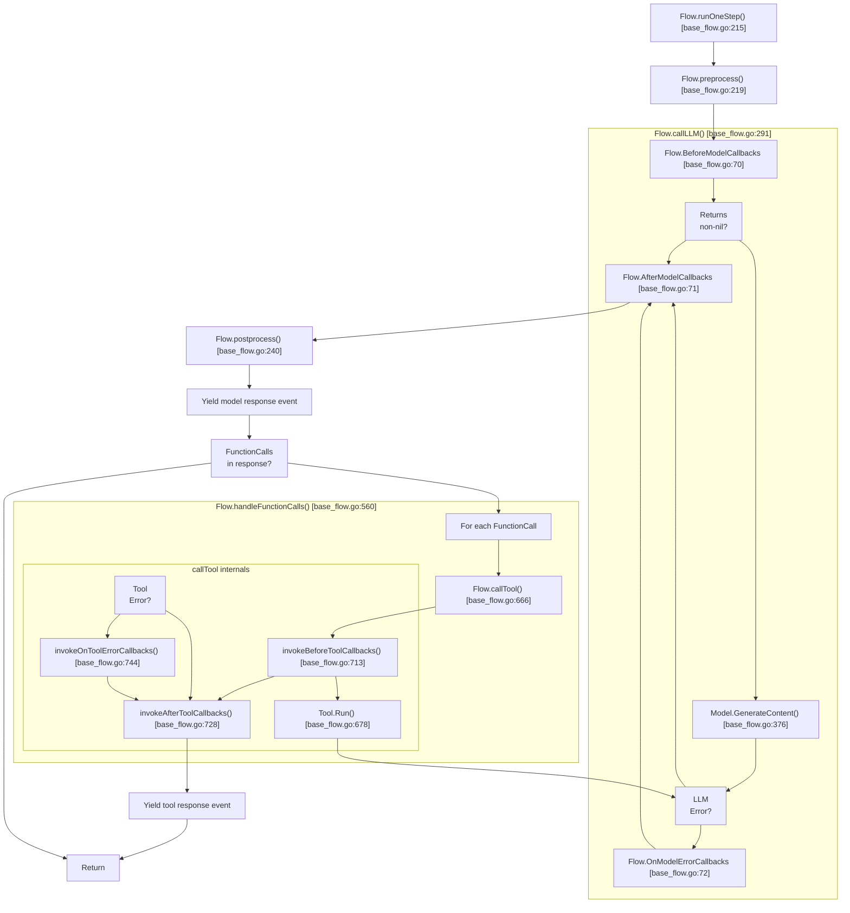

图里的行号是 DeepWiki dump 那一版。当前源码对应关系：

- `runOneStep` → `base_flow.go:612`
- `callLLM` → `base_flow.go:815`
- `handleFunctionCalls` → `base_flow.go:1160`
- `callTool` → `base_flow.go:1374`
- `invokeBeforeToolCallbacks` → `base_flow.go:1421`

Callback 拿到的是 `agent.Context`，能读写 session state、artifact、memory。`BeforeAgentCallback` 里写的 state，同一轮的 model / tool callback 能看见。

## 工具执行

模型响应里有 function call，就走 `handleFunctionCalls`。

同一轮多个 call 默认并发，走 context 上的 task runner（`platform.WithTaskRunner` 可换）。每个 call 包一层 execute_tool span，再进 `callTool`：

```text
callTool
  Plugin.BeforeTool / BeforeToolCallback   非 nil 则跳过 Tool.Run
  Tool.Run
  出错 → Plugin.OnToolError / OnToolErrorCallback
  Plugin.AfterTool / AfterToolCallback     可替换 result
  还是 error → {"error": err.Error()}
```

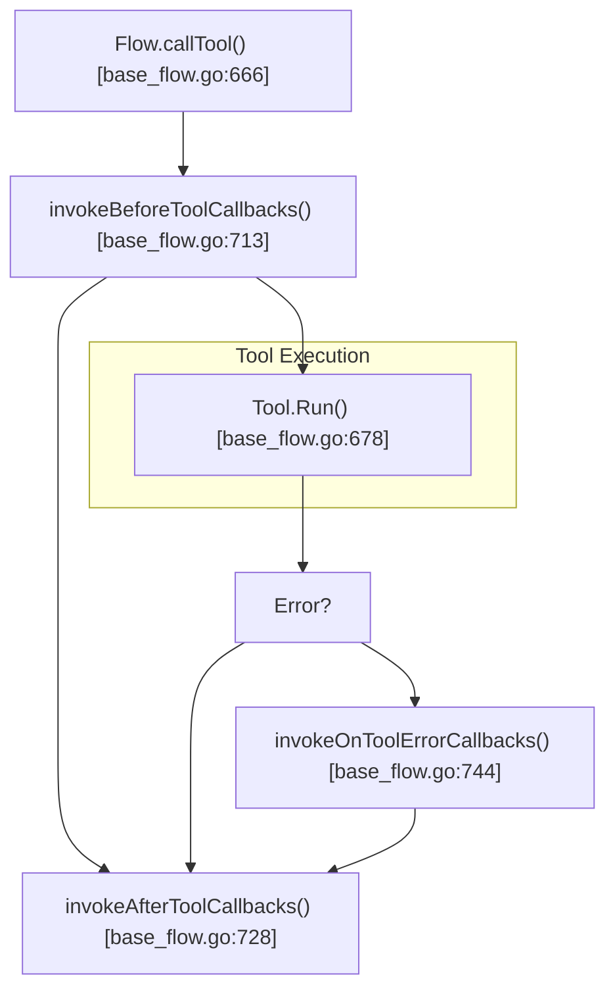

Live 模式下，streaming tool 不会在这一步等完。Flow 先返回 pending status，真正的 chunk 通过 `liveSession.Send` 往回推，并登记到 `liveSessionImpl.activeTools`，好让 `stop_streaming` 取消。普通 SSE 则把结果聚成一条 response。

工具如果要求确认，`RequestConfirmationRequestProcessor` 负责协议事件；`runOneStep` 会先 yield 工具结果，再 yield confirmation，这样即使 UI 卡在审批上，已完成的 tool result 也已经进 session。

`transfer_to_agent` 也是普通 function call。执行后 `ev.Actions.TransferToAgent` 被填上，`runOneStep` 用 `agentToRun` 在 transfer target 里找下一个 agent，再 `Run` / `RunNode` 把事件继续往外转。

## Event

模型和工具的输出都落成 `session.Event`：

```go
// session/session.go:100
type Event struct {
	model.LLMResponse
	ID             string
	Timestamp      time.Time
	InvocationID   string
	Branch         string
	IsolationScope string
	Author         string
	Actions        EventActions
	LongRunningToolIDs []string
	// workflow 相关：Routes / RequestedInput / Output / NodeInfo
}
```

| 字段 | 用途 |
| --- | --- |
| `Author` | 哪个 agent / user 写的 |
| `LLMResponse` | content、usage、partial、transcription |
| `Actions.StateDelta` | 工具或逻辑改过的 session state |
| `Actions.TransferToAgent` | 要交给谁 |
| `Branch` | 多 agent 时隔离历史 |
| `IsolationScope` | task / single-turn 的精确隔离 |
| `LongRunningToolIDs` | 客户端据此知道哪些 call 还在跑 |

`finalizeModelResponseEvent` 会补 function call ID，把 `callLLM` 期间积累的 `stateDelta` 写进 event，并标出 long-running tool。

## 流式聚合

模型按 chunk 往外吐，系统却同时要两件事：UI 要 partial，session / 工具执行要完整响应。`streamingResponseAggregator` 就是这层缓冲。

真正的 chunk 聚合发生在 model 实现里（Gemini 的 `generateStream`），Flow 消费的已经是 `model.LLMResponse`。Aggregator 自己记：

| 字段 | 作用 |
| --- | --- |
| `sequence` | 已完成的 parts：文本、function call、其它 |
| `currentTextBuffer` | 正在拼的文本 |
| `currentTextIsThought` | 当前 buffer 是不是 thought |
| `currentFunctionArgs` | 按 JSON path 拼起来的部分参数 |
| `finishReason` | 模型给的结束原因 |
| `currentThoughtSignature` | 跨 chunk 传递 thought signature |

文本和 thought 不能混在同一个 part 里。chunk 的 `Thought` 标记一变，就先 `flushTextBufferToSequence`。

Function call 支持 SSE 渐进参数。`PartialArgs` 按 JSON path（例如 `$.location`）写进 `currentFunctionArgs`，字符串会按 path 拼上。`WillContinue == false` 时 `flushFunctionCallToSequence`，这条 call 才进入 `sequence`。并行多个 call 就按完成顺序 append。

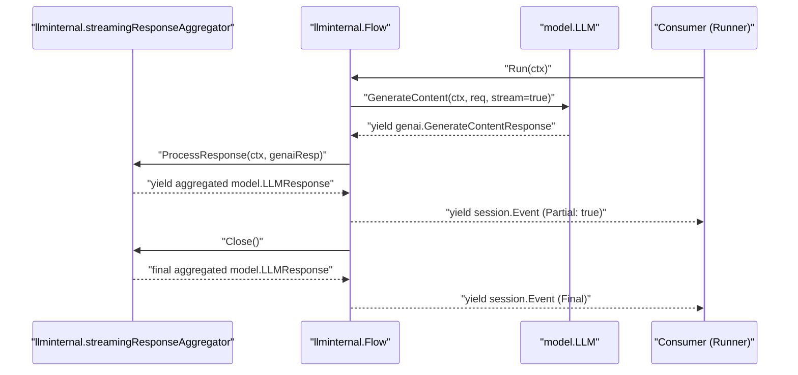

`ProcessResponse` 把 raw genai 响应转成 `model.LLMResponse`，标 `Partial = true` 先 yield 一份；`Close()` 冲掉剩余 buffer，给出最终聚合结果。Runner 只把非 partial event 当完整历史，partial 主要给 UI。

## RunLive

双向流 / 文本不走 `Run` 那套 SSE 循环，而是 `RunLive`。模型必须能拿出 `*genai.Client`，并且 `RunConfig.Live` 在。

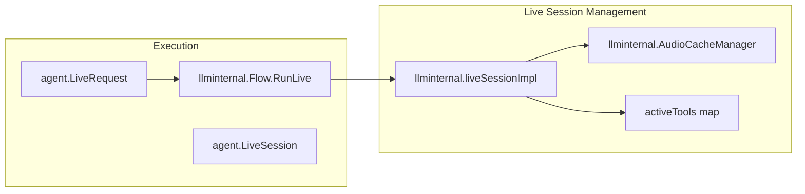

`liveSessionImpl` 管输入输出 channel、audio cache、正在跑的 streaming tools。连接可恢复：EOF、broken pipe、connection reset、GoAway 这类错误会带着 resumption handle 重连，并且用 context cancel 回收旧连接上的 goroutine，避免泄漏。

## 相关代码

| 主题 | 文件 |
| --- | --- |
| Flow 主循环 | [`internal/llminternal/base_flow.go`](https://github.com/google/adk-go/blob/master/internal/llminternal/base_flow.go) |
| 内容拼装 | [`internal/llminternal/contents_processor.go`](https://github.com/google/adk-go/blob/master/internal/llminternal/contents_processor.go) |
| Instruction 注入 | [`internal/llminternal/instruction_processor.go`](https://github.com/google/adk-go/blob/master/internal/llminternal/instruction_processor.go) |
| Output schema | [`internal/llminternal/outputschema_processor.go`](https://github.com/google/adk-go/blob/master/internal/llminternal/outputschema_processor.go) |
| 流式聚合 | [`internal/llminternal/stream_aggregator.go`](https://github.com/google/adk-go/blob/master/internal/llminternal/stream_aggregator.go) |
| Session event | [`session/session.go`](https://github.com/google/adk-go/blob/master/session/session.go) |
| Branch 判断 | [`internal/utils/utils.go`](https://github.com/google/adk-go/blob/master/internal/utils/utils.go) |
| LLM 抽象 | [`model/llm.go`](https://github.com/google/adk-go/blob/master/model/llm.go) |

原文是 DeepWiki 上拼接的 5 页：LLM Flow Execution、Request and Response Processors、Content Processing Pipeline、Model and Tool Callbacks、Streaming Response Aggregation。站内无效路径 `/google/adk-go/4.2.*` 已改成 GitHub 文件和文内章节。
