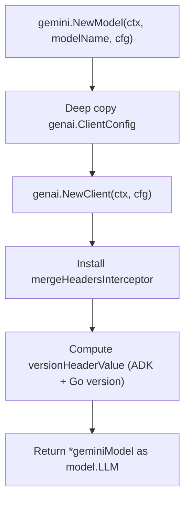
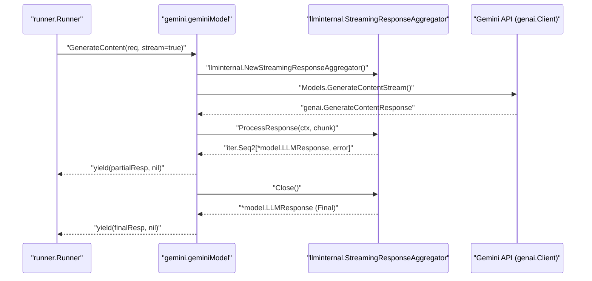

代码位置 `model`
```text
model .
├──  apigee
├──  gemini
├──  openaimodel
├──  llm.go
├──  registry.go
```
## LLM

LLM 就是进行 LLM Request 的抽象，进行 generate content。

本身是一个很薄的统一抽象层：

  - model/llm.go:25 定义 LLM，只有 Name() 和 GenerateContent(...) iter.Seq2[...]。
  - model/llm.go:31 的 LLMRequest 使用统一的 genai.Content 和 genai.GenerateContentConfig。
  - model/llm.go:40 的 LLMResponse 承载内容、usage、引用、logprobs、错误、finish reason，以及流式状态 Partial、
    TurnComplete。
  - LLMRequest.Tools 是框架内部工具对象表，真正发送给 provider 的工具声明来自 req.Config.Tools。

```go
// LLM provides the access to the underlying LLM.
type LLM interface {
    Name() string
    GenerateContent(ctx context.Context, req *LLMRequest, stream bool) iter.Seq2[*LLMResponse, error]
}

// LLMRequest is the raw LLM request.
type LLMRequest struct {
	Model    string
	Contents []*genai.Content
	Config   *genai.GenerateContentConfig

	Tools map[string]any `json:"-"`
}

// LLMResponse is the raw LLM response.
// It provides the first candidate response from the model if available.
type LLMResponse struct {
	Content             *genai.Content                              `json:"content,omitempty"`
	CitationMetadata    *genai.CitationMetadata                     `json:"citationMetadata,omitempty"`
	GroundingMetadata   *genai.GroundingMetadata                    `json:"groundingMetadata,omitempty"`
	UsageMetadata       *genai.GenerateContentResponseUsageMetadata `json:"usageMetadata,omitempty"`
	CustomMetadata      map[string]any                              `json:"customMetadata,omitempty"`
	LogprobsResult      *genai.LogprobsResult                       `json:"logprobsResult,omitempty"`
	InputTranscription  *genai.Transcription                        `json:"inputTranscription,omitempty"`
	OutputTranscription *genai.Transcription                        `json:"outputTranscription,omitempty"`
	ModelVersion        string                                      `json:"modelVersion,omitempty"`
	// Partial indicates whether the content is part of a unfinished content stream.
	// Only used for streaming mode and when the content is plain text.
	// The Runner fully processes only the final non-partial event, partial
	// events are simply forwarded downstream (eg. to UI for display).
	Partial bool `json:"partial,omitempty"`
	// Indicates whether the response from the model is complete.
	// Only used for streaming mode.
	TurnComplete bool `json:"turnComplete,omitempty"`
	// Flag indicating that LLM was interrupted when generating the content.
	// Usually it is due to user interruption during a bidi streaming.
	Interrupted             bool               `json:"interrupted,omitempty"`
	SessionResumptionHandle string             `json:"sessionResumptionHandle,omitempty"`
	ErrorCode               string             `json:"errorCode,omitempty"`
	ErrorMessage            string             `json:"errorMessage,omitempty"`
	FinishReason            genai.FinishReason `json:"finishReason,omitempty"`
	AvgLogprobs             float64            `json:"avgLogprobs,omitempty"`
}

```
 - 使用 `google.golang.org/genai`。Gemini 实现几乎零转换；OpenAI 实现要把这两样翻成 Responses API。
 - Tools 带 json:"-"，不进序列化。 这是运行时的「名字 → 工具对象」字典，给 Flow 回头执行 FunctionCall 用。发给模型的声明在 Config.Tools（[]*genai.Tool）里。两份数据由 toolutils.PackTool（tool/toolutils/toolutils.go:40-73）同时写入：req.Tools[name] = t，并把 Declaration() 并进同一个 genai.Tool.FunctionDeclarations。
 - Model 字段可被 BeforeModel 回调改写。 Gemini 的 modelName（gemini.go:120-125）优先用 req.Model，构造时的名字只是 fallback——所以回调能在不换 LLM 实例的情况下换模型。


## 调用链

整体调用链是：
```text
  llmagent
    -> llminternal.Flow
    -> 请求处理器 / 工具预处理
    -> BeforeModel callbacks
    -> model.LLM.GenerateContent
    -> streamingResponseAggregator
    -> AfterModel / OnModelError callbacks
    -> session.Event
```
  关键位置：

  - agent/llmagent/llmagent.go:450
  - internal/llminternal/base_flow.go:815
  - internal/llminternal/base_flow.go:939
  - session/session.go:100

调用方：
 1. llminternal/base_flow.go#Flow.callLLM{generateContent()}
 2. session/compaction/llm_sumarrize.go#SummarizeEvents

core caller 就是 callLLM 了

```go
func (f *Flow) callLLM(
	ctx agent.InvocationContext,
	req *model.LLMRequest,
	stateDelta map[string]any,
	artifactDelta map[string]int64,
) iter.Seq2[*responseWithEventID, error] {
	return func(yield func(*responseWithEventID, error) bool){
        /// ...
	}
}
```

流程
``` text
callLLM(ctx, req)                                          base_flow.go:815
  1. Plugin.BeforeModel  —— 非 nil 响应/错误 → 短路，不打模型   :820
  2. 用户 BeforeModelCallbacks，同样短路                       :827
  3. useStream = (RunConfig.StreamingMode == "sse")            :845
  4. generateContent(...)                                      :850 / 907
       ├─ StartGenerateContentSpan（只包 LLM 调用）            :911
       ├─ m.GenerateContent(ctx, req, useStream)               :939
       ├─ 非 partial 才 LogResponse，并立刻 End span           :946
       └─ yield responseWithEventID{resp, NewUUID}             :940 / 811
  5. 出错 → OnModelErrorCallbacks（可把错误变成假响应）        :852 / 980
  6. PopulateClientFunctionCallID（补空的 call ID）            :869
  7. AfterModelCallbacks（可替换响应）                         :871 / 958
```

more detail see adk-flow

## 实现

——> 继续回到 LLM

有三个实现

 - apigee：
	> Apigee is Google Cloud's native API management platform that can be used to build, manage, and secure APIs — for any use case, environment, or scale.
 - gemini
 - openaimodel

### gemini

sdk 封装

```go
type geminiModel struct {
	client             *genai.Client
	name               string
	versionHeaderValue string
}

func (m *geminiModel) Name() string {return m.name}

// GenerateContent calls the underlying model.
func (m *geminiModel) GenerateContent(ctx context.Context, req *model.LLMRequest, stream bool) iter.Seq2[*model.LLMResponse, error] {
	// ...

	if stream {
		return m.generateStream(ctx, req)
	}

	return func(yield func(*model.LLMResponse, error) bool) {
		resp, err := m.generate(ctx, req)
		yield(resp, err)
	}
}
```




### openai
sdk 封装/ 消息转化

```go
type openAIModel struct {
	client *openai.Client
	name   string
}
```

  - model/openaimodel/request.go:36：请求模型名、内容、角色、函数调用和函数响应转换。
  - assistant 历史消息必须转成 output_text，不能作为普通 input_text 发送。
  - 缺少函数调用 ID 时生成 adk-openai-call-N，并用 tracker 匹配后续函数响应。
  - model/openaimodel/request.go:315：翻译 temperature、TopP、最大 token、JSON schema、logprobs、thinking、service
    tier 等配置。
  - 不支持的 Gemini 字段会明确返回 sentinel error，而不是静默丢弃；HTTPOptions.Headers 则刻意忽略，避免 Gemini
    header 或 Authorization 泄漏到 OpenAI。
  - 只支持 function tools，拒绝 retrieval、search、maps、code execution 等其他工具类型，见 model/openaimodel/
    tools.go:31。
